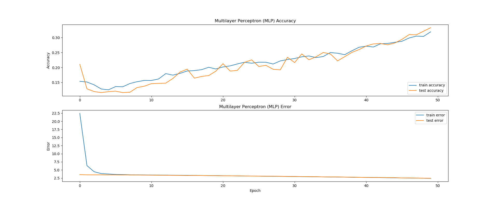

## Music Genre Classification
Classify raw audio by musical genre with deep learning techniques.

### Results

### Source
The idea, methodology, and code for this project were inspired by Valerio
Velardo's youtube series titled 'Deep Learning (for audio) with Python'. This
tutorial series can be found here:
https://www.youtube.com/playlist?list=PL-wATfeyAMNrtbkCNsLcpoAyBBRJZVlnf.

### PS
This is my first github project.
